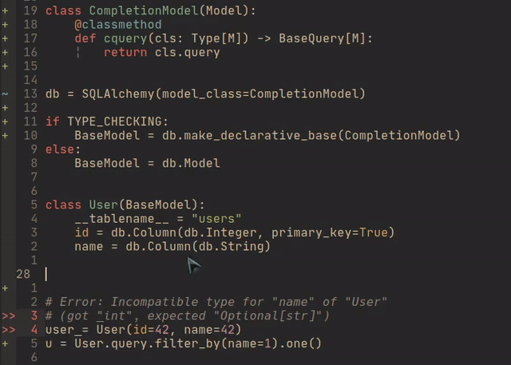

Mypy plugin and stubs for Flask-SQLAlchemy
=====================

Please check example directory.

*Important*: you need to enable the plugin in your mypy config file, **and pycharm doesn't support mypy plugin.**

::

  [mypy]
  plugins = flasksqlamypy

Exapmle
---------------
::

  from typing import TYPE_CHECKING
  from flask_sqlalchemy import SQLAlchemy

  db = SQLAlchemy()
  
  if TYPE_CHECKING:
      from flask_sqlalchemy.model import Model

      BaseModel = db.make_declarative_base(Model)
  else:
      BaseModel = db.Model

  class User(BaseModel):
      __tablename__ = 'users'
      id = db.Column(db.Integer, primary_key=True)
      name = db.Column(db.String)

  user = User(id=42, name=42)  # Error: Incompatible type for "name" of "User"
                               # (got "int", expected "Optional[str]")
  user.id  # Inferred type is "int"
  User.name  # Inferred type is "Column[Optional[str]]"

Install
-----------------
::

  pip install git+https://github.com/ssfdust/flask-sqlalchemy-stubs.git 

Jedi Completion Tricks
----------------

You can define a classmethod with `self` typed, which makes jedi completion to
work. Please check examples/sample.py for the entire example.

